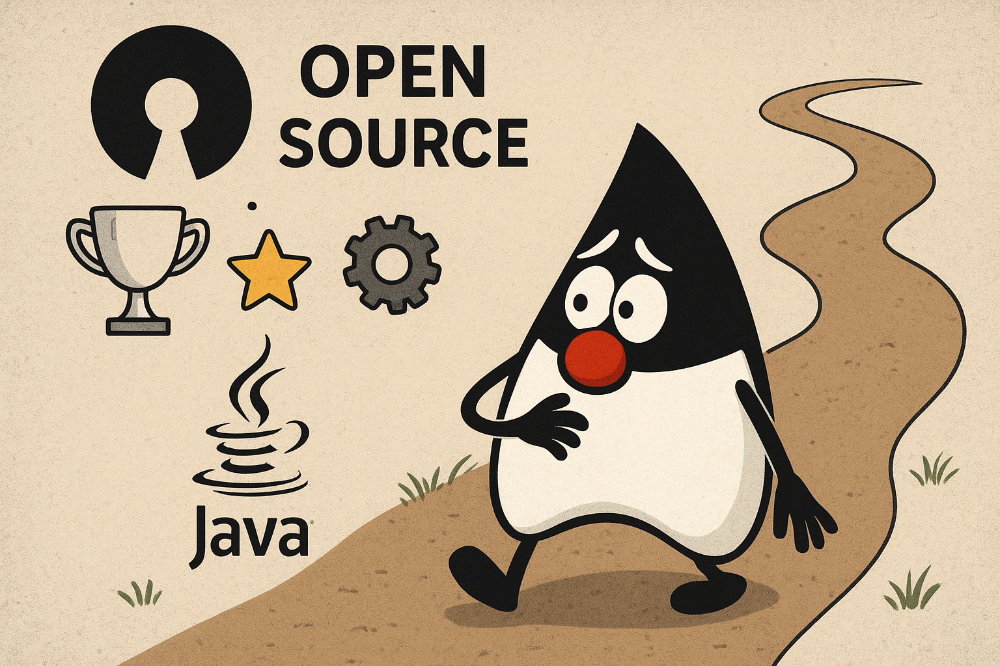
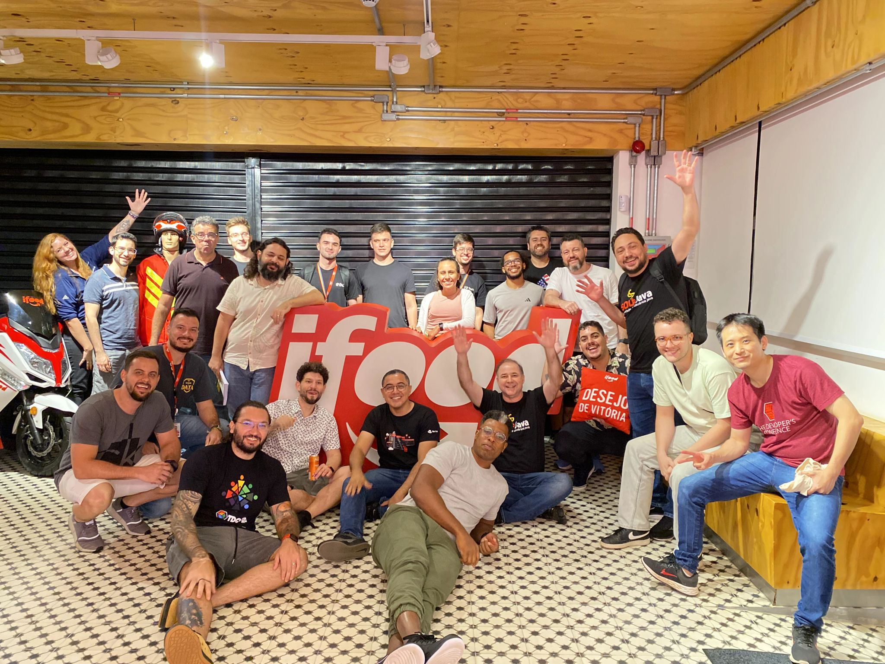
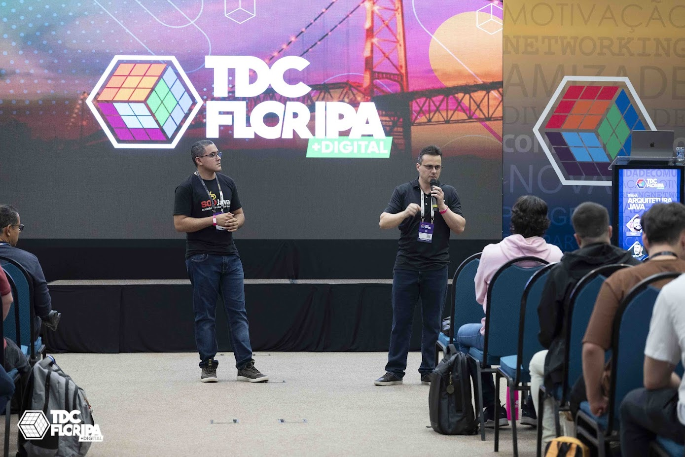
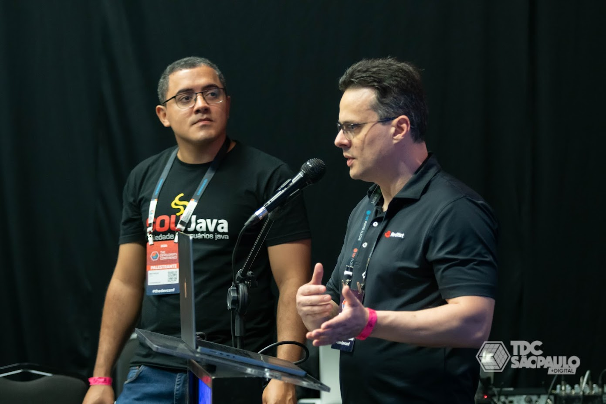
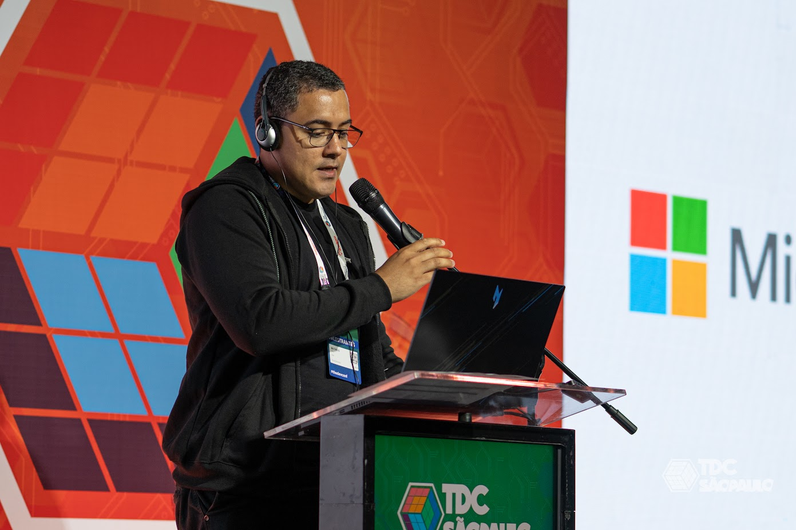
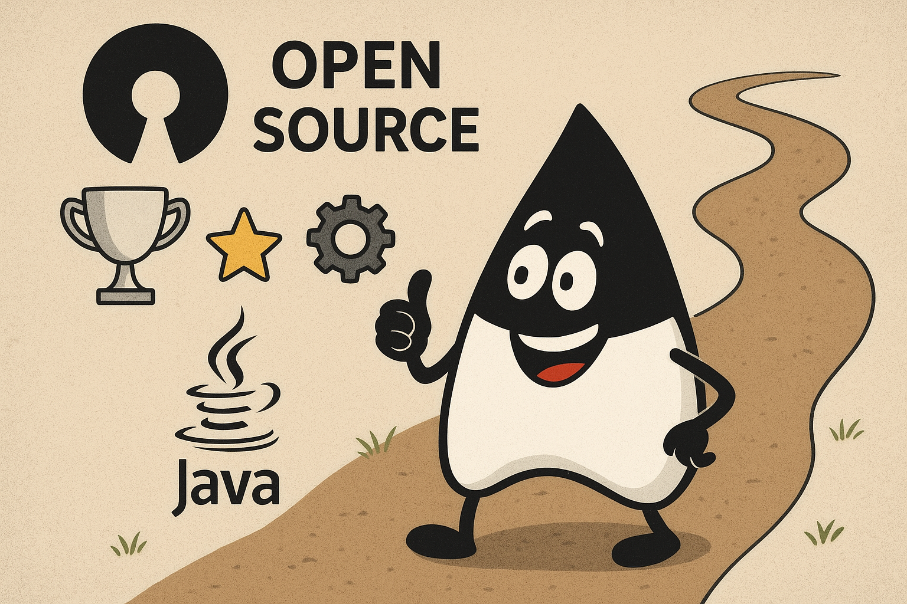

_Oi pessoal, tudo bem com vocês? Nesse post, gostaria de deixar aqui um pouco da minha jornada, a ideia aqui é dar uma
introdução para os próximos posts. Quero deixar os meus aprendizados em forma de dicas para você e espero que te
ajude de alguma forma_ ❤️

E antes de começar, quero agradecer a Deus e a minha esposa por estar comigo durante todo esse caminho até aqui.

## Onde tudo começou...

Eu já participava de muitas lives do [SouJava](https://www.youtube.com/@SouJava) e já quero começar dizendo que:
Contribuir com
Open Source não é apenas contribuir com código, documentar um projeto ou palestrar em um grande evento de tecnologia,
mas também é apoiar a comunidade com a sua presença. E foi nessa
live [aqui](https://www.youtube.com/watch?v=g0FgpxmgmPs)
que a minha jornada no Open Source se iniciou.

Um simples comentário:

> could you indicate some open source projects for those who are starting now in open source project?

E daí por diante, virei o estagiário de um grande amigo meu, [**Mauricio Salatino**](https://www.salaboy.com/), e
comecei resolvendo algumas issues de um workshop que se chama [_From Monolith to
K8S_](https://github.com/salaboy/from-monolith-to-k8s).

### Dica
> Não tenha medo de perguntar, não tenha medo de errar, não tenha medo de se expor. A comunidade Open Source é
> feita de pessoas que querem ajudar outras pessoas, se ninguém vir contribuir, como o projeto vai continuar? Só erra quem tenta.

## Um estagiário generalista

No projeto _From Monolith to K8S_ testei e experimentei diversas tecnologias, KinD, Kubernetes, Tekton, GoLang, Helm,
Keycloak, Hashicorp Vault,
OAuth2, Knative, ExternalSecrets, Camunda e diversos outros projetos de código aberto. Foi uma ótima experiência
navegando por diversas
tecnologias Cloud Native, contribui bastante. Participei do meu primeiro Hacktoberfest, Mas se você é um desenvolvedor
de Software, você já passou por uma fase onde você
quer abraçar o mundo, abraçar o máximo possível de tecnologias e não se aprofundar em nenhuma.

E como tudo na nossa vida é um trade-off, você tem lado bom e lado mau, o lado bom de querer abraçar tudo é que para ser
sincero, é divertido, tudo sempre vai ser novo, a dopamina de completar um **Getting Started** é realmente empolgante.
Mas o lado mau é que você não cria raiz, não se aperfeiçoa em algo, não ganha profundidade e não se torna um
especialista
em algum assunto.

### Dica

> Se você quer começar a contribuir num projeto Open Source, não tem problema navegar por diversos assuntos/tecnologias,
> mas não faça isso por muito tempo, foque em um projeto específico e é claro que você goste.

## O início do estagiário especialista

Se lembra que mencionei que Open Source é também contribuir com a sua presença?

Em outra live do [SouJava](https://www.youtube.com/watch?v=NxBX7mBkTBA) conheci
o [Helber Belmiro](https://www.linkedin.com/in/hbelmiro),
uma referência na comunidade Open Source e Java. Foi nessa live que descobri o
projeto [quarkiverse/quarkus-openapi-generator](https://github.com/quarkiverse/quarkus-openapi-generator) e,
por meio desta [issue](https://github.com/quarkiverse/quarkus-openapi-generator/issues/312), comecei a contribuir com o
projeto. 

Naquela época eu ainda era um pouco generalista, mas foi ali que decidi reduzir o foco e me aprofundar em assuntos mais específicos, nesse caso, o mundo Quarkus (**quarkiverse**).

### Dica
> Não tenha medo de começar pequeno, comece com pequenas contribuições, pequenas issues, pequenas documentações, o
> importante é começar.

## Uma conversa que me abriu a mente

No fim de 2023 decidi que queria uma mudança na minha carreira, eu já trabalhava no Mercado Livre e desenvolvia
funcionalidades
para uma plataforma interna muito conhecida no mundo Cloud Native que se
chama [Fury](https://medium.com/mercadolibre-tech/subpage/fury), era o emprego dos meus sonhos. Mas faltava algo,
eu não sei muito bem o motivo, mas de forma interna, sabia que os meus sonhos e objetivos eram voltados para o Open
Source e em ajudar
outras pessoas/desenvolvedoras. Eu já tinha pequenas contribuições no **quarkus-openapi-generator**, mas eram poucas, eu
queria mais.

Foi aí que busquei uma mentoria com o Pedro Cavalero e ele me indicou o meu caso (Open Source) para o Bruno Souza (
javaman). Eu infelizmente, não estava em
condições naquele momento de bancar com a mentoria, mas meus amigos... esse
livro [aqui](https://skills.code4.life/bestyear/) é simples, mas sensacional. Ele fala sobre
como planejar e definir os seus objetivos de carreira para o seu ano (o mais interessante é que o ano estava quase
começando quando conversamos, foi o tempo perfeito) e ele junto com a mentoria me ajudaram e muito.

Se lembra que falei que o lado ruim de abraçar diversas tecnologias é que você não cria raizes e profundidade, foi
depois dessa
conversa que eu tracei alguns objetivos para o ano de 2024:

* Me tornar referência Quarkus no Brasil
* Terminar de ler alguns livros de tecnologia

Eu tinha mais um ou dois, mas não me lembro mais 🙂

E foi aí que decidi aprofundar-me e criar raízes em uma tecnologia que estava ecoando no mundo Java.

### Dica
> Defina objetivos claros e específicos para a sua carreira, isso vai te ajudar a manter o foco e a medir o seu progresso.
> Procure também mentores que possam te ajudar a traçar esses objetivos e te guiar durante a sua jornada. Vou deixar aqui dois nomes
> que me ajudaram muito: **Bruno Souza (javaman)**, **Helber Belmiro**, **Pedro Cavalero** e **Elder Moraes**.

## Quarkus, Quarkus e Quarkus

E você deve estar se perguntando o motivo pelo qual eu defini o objetivo de ser referência **Quarkus**, minha esposa me
fez essa mesma pergunta
enquanto eu escrevia esse post.

Eu disse que era pelo motivo de ser uma tecnologia relativamente nova no mundo Java e estava
fazendo muito barulho, era o **hype** do momento para o mundo Java. Eu anteriormente tentei contribuir com pequenas
contribuições em projetos Spring ([Spring Cloud AWS](https://awspring.io/))
mas não dei continuidade, eu estava realmente decidido em focar apenas no universo Quarkus.

### Primeira contribuição

E aqui gostaria de deixar o passo-a-passo que funcionou para mim, eu:

* Experimentei a tecnologia como usuário;
* Li diversas documentações voltadas para usuário Quarkus e desenvolvedores internos;
* Fui curioso e tentei descobrir o que acontecia por debaixo dos panos;
* Vi diversas palestras de diversos contribuidores do projeto;
* Entrei em contato com os mantenedores e fiz diversas perguntas sobre as palestras deles (eu realmente perturbei muitos
  deles);

E durante isso, realizei a minha primeira contribuição no projeto **quarkus/quarkusio**, e você deve estar achando que
adicionei um código monstruoso, certo?

Não! Foi [um pull request de oito caracteres](https://github.com/quarkusio/quarkus/pull/38192/files). E sabe como eu
descobri essa issue? Experimentando,
usando o projeto como usuário final.

### Compartilhando conhecimento

Depois das algumas contribuições no **quarkus-openapi-generator** e de ter estudado, investigado e experimentado as
extensões Quarkus, decidi falar o que aprendi sobre.

Criei o meu Blog que se chama https://matheuscruz.dev falando sobre como criar uma extensão Quarkus, como funciona, o que é extender o Quarkus, o que você consegue fazer, etc.
Uma coisa muito interessante sobre isso, é que isso fica documentado (eu recorri essa semana ao meu primeiro post), você fortalece o seu conhecimento e depois de muita persistência, querendo ou não, se tona uma autoridade no assunto.

Uma forma bem interessante de aprender mais sobre um assunto é compartilhando ele, e foi no canal Quarkus Club que
palestrei pela primeira vez. Foi um dia muito legal,
agradeço ao Luis Llamas pela parceria e todas as oportunidades durante todo esse tempo.

<iframe width="560" height="315" src="https://www.youtube.com/embed/AUywWR689Rs?si=dzEg2QuTpaTv8v_t" title="YouTube video player" frameborder="0" allow="accelerometer; autoplay; clipboard-write; encrypted-media; gyroscope; picture-in-picture; web-share" referrerpolicy="strict-origin-when-cross-origin" allowfullscreen></iframe>

Um fato bem importante desse vídeo, é que no final, o grande **George Gastaldi** apareceu, se você não o conhece, ele é a
terceira pessoa que mais contribuiu com o código do **Quarkus**, foi uma surpresa e um medo gigante de estar falando
besteira, mas ele até me convidou para falar sobre o assunto no futuro, e daqui a pouco falo sobre isso.

Palestrei presencialmente pela primeira vez com o meu grande amigo Mauricio Salatino (salaboy) no iFood falando sobre [Dapr](https://dapr.io) mas usando [Quarkus](https://github.com/mcruzdev/pizza-quarkus).

Iniciei a primeira dupla sertaneja Java do Brasil, conhecida como George e Matheus, e nosso primeiro show foi no TDC Florianópolis 2024 falando sobre **Desbravando o Quarkus: Criando extensões para a sua aplicação nativa de nuvem**.

A dupla George e Matheus ataca novamente: Realizamos um Workshop sobre Quarkus no TDC São Paulo 2024 com o título **Quarkus Super-Heroes Workshop: From Zero to Hero!**

É... graças a **Deus** o ano de 2024 realmente foi incrível para mim.

### Dica
> Compartilhe o que você aprendeu, crie conteúdos, palestras, vídeos, blogs, tutoriais. Isso vai te ajudar a fortalecer
> o seu conhecimento e você vai se tornar uma autoridade no assunto.

## Dando continuidade em 2025

Uma coisa muito importante é dar continuidade, é ser resiliente, é ser consistente. Eu confesso que eu tenho 
muita dificuldade em ser consistente, eu tenho muita dificuldade em manter o foco, e perco o foco facilmente e isso é um problema pra mim. Mas felizmente eu continuei com
minhas pequenas contribuições, coloquei como foco estar entre os **top 100 contribuidores do Quarkus e consegui**.

### Quarkus Roq

Continuei contribuindo com os projetos, e você não precisa enviar um commit todo dia e se desesperar por ter perdido uma revisão de pull request. As vezes o seu foco vai mudar um pouco e o meu mudou...
Eu comecei a criar mais conteúdos e participar e ajudar a comunidade do que contribuir realmente com o código, tudo bem ainda contribua com diversas outra extensões. Esse blog aqui por exemplo foi feito com o [Roq](https://iamroq.com), uma extensão Quarkus
que te permite criar sites estáticos.

<iframe width="560" height="315" src="https://www.youtube.com/embed/hrF1a5sKqBI?si=Hn0UnMskV9yJNbAZ" title="YouTube video player" frameborder="0" allow="accelerometer; autoplay; clipboard-write; encrypted-media; gyroscope; picture-in-picture; web-share" referrerpolicy="strict-origin-when-cross-origin" allowfullscreen></iframe>

### Clube do livro (Quarkus in Action)

Junto com a comunidade Quarkus, iniciamos um clube do livro com o intuito de estudar o livro Quarkus in Action escrito por **Martin Stefank** e **Jan Martiska**.

<iframe width="560" height="315" src="https://www.youtube.com/embed/w3Sj8YhRzyU?si=Ij9Iplp3B67vd0wQ" title="YouTube video player" frameborder="0" allow="accelerometer; autoplay; clipboard-write; encrypted-media; gyroscope; picture-in-picture; web-share" referrerpolicy="strict-origin-when-cross-origin" allowfullscreen></iframe>

### Dapr Meteor 🚀

Eu comecei a contribuir um pouco mais com o [Dapr Java SDK](https://github.com/dapr/java-sdk) e a compartilhar conhecimento sobre, mas sempre usando o Quarkus.
Pela primeira vez palestrei em inglês sobre Dapr no [TDC São Paulo de 2025](https://thedevconf.com/tdc/2025/sao-paulo/trilha-ai-and-emerging-tech).

Foi uma experiência diferente para mim e fui nomeado um [Dapr Meteor](https://dapr.io/community/program/) 🚀, e sinceramente, fiquei muito feliz por isso.

### Dica
> Dê continuidade, seja resiliente, seja consistente. Não desista no primeiro obstáculo, não desista no primeiro comentário negativo, apenas continue.

## Próximos passos

Bom, talvez você achou a imagem do Duke um pouco estranha... eu quis resumir um pouco a minha história no mundo Open Source e agora eu tenho um caminho desconhecido pela frente,
vou trabalhar na IBM, diretamente com Open Source, ser pago para trabalhar nos projetos e com as pessoas que eu já interagido através de pull request, chats no Zulip e issues.

Talvez esse caminho, vai ser potencializar o que já venho feito durante todo esse tempo, eu não sei... As vezes me sinto incapaz, será se vou dar conta? Eu não sei... Só sei de uma coisa, vou 
me esforçar, me dedicar e quero compartilhar a continuação dessa jornada com vocês. 

## Conclusão 

Se você leu até aqui, muito obrigado! Quero deixar aqui o meu convite para você começar agora, não deixe para depois.

Você pode encontrar uma issue nesse repositório [aqui](https://github.com/mcruzdev/issues-i-can-help-you-with), eu sempre coloco `good first issues` lá, para você começar a contribuir com projetos Open Source.

Até logo e até os próximos posts 👋👋👋!

